# 卓注文アプリ 公開手順書（セミナー版・テストモード）

このアプリ（客スマホ・キッチン・ホールが**リアルタイム同期**する卓注文システム）を、
自分のアカウントで**インターネットに公開**し、**Stripe のテスト決済**まで動かすための手順です。

> 📘 **はじめての方は先に** [クローンから自分用環境をつくる.md](クローンから自分用環境をつくる.md) **を読んでください。**
> GitHub からの取得・自分専用 Convex の作成・環境変数の手入力方針をまとめています。
> この手順書はセミナー**有料特典リポ**（public・URL は有料参加者にのみ案内）に同梱されています。

- 想定: プログラミング未経験でも、上から順にそのまま進めれば公開できる
- 料金: この手順の範囲はすべて**無料／テストモード**（実際のお金は動きません）
- 所要時間: 約 40〜60 分（**セミナー後**に自分のペースで）
- ゴール: `https://〇〇.vercel.app` で自分のお店の卓注文アプリが動く

> 💡 画像について：各所に**仮のイメージ図（SVG）**と、一部**実スクリーンショット（PNG）**があります（`images/`）。
> 手順を進めながら自分で撮った画面に差し替えても構いません。
> **差し替え方**：PNG を `images/` に置き、本文の `` を `.png` に変える。

---

## 全体像（何をするのか）

このアプリは3つの部品でできています。

```
   あなたのPC（コード）
        │  ① Convex に「頭脳（データ・注文ロジック）」を置く
        ▼
   Convex（クラウド・無料）  ←──③ Stripe（テスト決済）を接続
        │  ② Vercel に「画面」を置いて公開
        ▼
   Vercel（公開URL・無料）  →  お客さん・スタッフがブラウザで開く
```

やることは次の4ステップです。

1. **Convex** に頭脳を置く（クラウド接続）
2. **Stripe** のテストキーを Convex に教える
3. **Vercel** に画面を公開する
4. **動作確認**（注文 → キッチン → テスト決済）

---

## 用意するもの

- パソコン（Mac または Windows）とインターネット
- **このプロジェクトのフォルダ** … [クローンから自分用環境をつくる.md](クローンから自分用環境をつくる.md) の手順で取得
- **Node.js**（**20 LTS 推奨**、`v18` 以上でも可）… ターミナルで `node -v` と打って確認
  - 入っていなければ <https://nodejs.org/> の「LTS」をインストール
- 無料アカウント3つ（この手順の中で作ります）
  - **Convex** … <https://convex.dev>
  - **Stripe** … <https://stripe.com/jp>（テストモードを使うので審査・本登録は不要）
  - **Vercel** … <https://vercel.com>

> 🖥 「ターミナル」の開き方
> - Mac: アプリ「ターミナル」
> - Windows: 「PowerShell」
> どちらも、**クローンしたプロジェクトフォルダ**の中で開いてください（VS Code を使っている人は「ターミナル」メニューから）。

---

## ステップ0：プロジェクトを動かせる状態にする

ターミナルで、プロジェクトフォルダにいることを確認して次を実行します。

```bash
npm install
```

> 📸 **[0-1] インストール完了**
> `npm install` が終わって `added 〇〇 packages` と出た画面を撮影。
> → `images/0-1.svg`

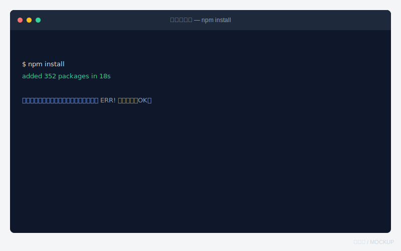

たくさん文字が流れて、最後にエラー（赤い `ERR!`）が出ていなければ成功です。

---

## ステップ1：Convex（頭脳）をクラウドに置く

### 1-1. Convex にログイン

```bash
npx convex login
```

ブラウザが開くので、**Continue with GitHub**（または Google）でログインし、`Approve` を押します。

> 📸 **[1-1] Convex ログイン許可画面**
> ブラウザに出る「Approve」ボタンの画面を撮影。
> → `images/1-1.svg`

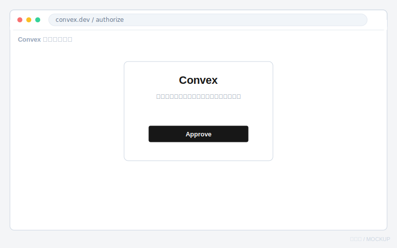

ターミナルに `Logged in` のような表示が出たらOKです。

### 1-2. クラウドにプロジェクトを作る

```bash
npx convex dev --configure new --team <あなたのチーム名> --project gaslab-order
```

- **チーム名** は自分のアカウント名（例 `ono`）。1人なら自動で1つだけあるはず。
- **リージョンを聞かれたら**「`US East (N. Virginia)`」を選ぶ（既定でハイライト → そのまま **Enter**）。
  - 日本から近いアジアは選択肢に無い。US East が Convex の標準・実績が多く、デモのリアルタイム同期は十分速い。
- `Convex functions ready!` と出て**接続待ち**になったら、**Ctrl+C で止める**（これで `.env.local` がクラウド向けに書き換わる）。

> 💡 すでに `npx convex dev` をローカルで一度動かしている場合は、上の `--configure new` で**クラウドに作り直す**のがポイント（ローカルのままだと公開できない）。

> 📸 **[1-2] リージョン選択とデプロイ完了**
> リージョン選択画面、または `Convex functions ready!` が出たターミナルを撮影。
> → `images/1-2.svg`

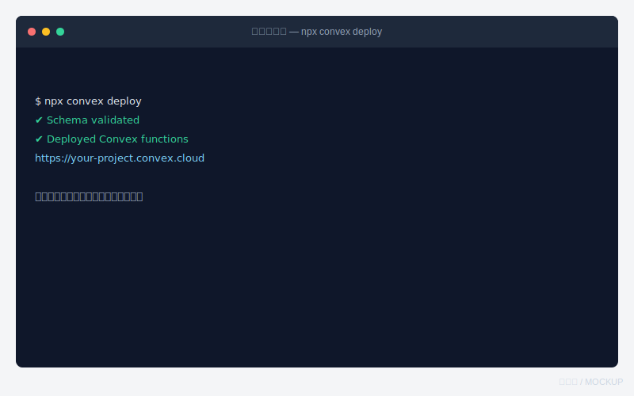

その後、本番用のデプロイを1回作っておく（Vercel が使う本番デプロイ）：

```bash
npx convex deploy
```

`Deployed Convex functions` と出れば本番側の準備OK。

### 1-3. Convex ダッシュボードを開いておく

ブラウザで <https://dashboard.convex.dev> を開き、いま作った `gaslab-order` プロジェクトを開きます。
あとで環境変数（Stripeキー）を入れるのでこのタブは開いたままに。

> 📸 **[1-3] Convex ダッシュボード**
> プロジェクトのトップ（左メニューに Data / Functions / Settings がある画面）を撮影。
> → `images/1-3.svg`

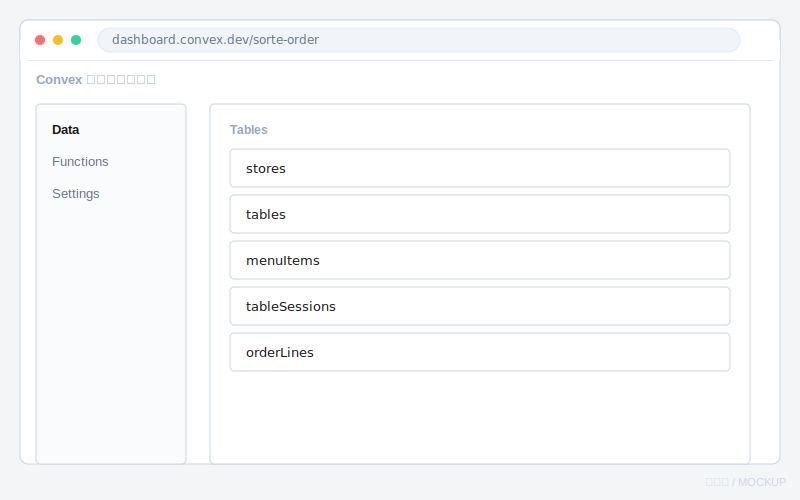

✅ **確認ポイント**：ダッシュボードの「Data」を開くと、`tables` `menuItems` などの表が並んでいる。

---

## ステップ2：Stripe（テスト決済）を接続する

> 🔁 Stripe と Convex を行き来して値を渡し合います。**どの値をどっちに入れるか**は
> [stripe-convex-フロー.md](stripe-convex-フロー.md) のフローチャートが分かりやすいです（設定・決済の2枚）。

### 2-1. Stripe にサインアップ／ログイン

<https://dashboard.stripe.com> を開きます。
右上が **「テスト環境」「テストモード」** になっていることを必ず確認してください（本番だと実際に課金されます）。

> 📸 **[2-1] Stripe テストモードの確認**
> 画面右上の「テスト環境」トグルがオン（テスト側）になっている状態を撮影。
> → `images/2-1.svg`

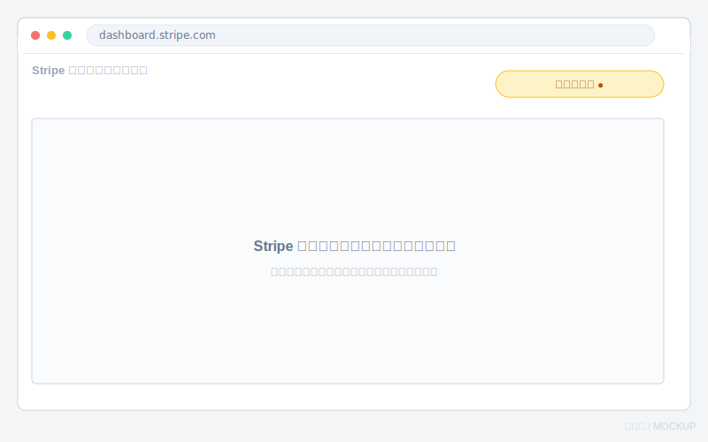

### 2-2. テスト用のシークレットキーをコピー

左メニュー（または右上）の **開発者 → API キー** を開きます。

- **シークレットキー**（`sk_test_` で始まる）の「表示」を押してコピー

> 📸 **[2-2] Stripe API キー画面**
> `sk_test_...` のシークレットキーが表示された画面を撮影（**キー本体は隠して**保存推奨）。
> → `images/2-2.svg`

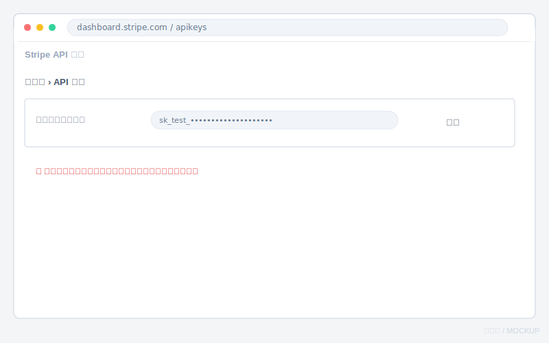

> ⚠️ シークレットキーはパスワードと同じです。人に見せたり、撮った画像をそのまま公開したりしないこと。

### 2-3. Convex にキーを登録（★本番=Production 側に入れる）

> ⚠️ **いちばんのつまづきポイント：dev と prod を間違えない**
> 公開アプリ（Vercel）が使うのは Convex の **本番（Production）デプロイ**。
> dev 側に入れても本番には効かず、会計で「開始に失敗」になります。

**方法A：ダッシュボード（おすすめ・目で確認できる）**
**Convex ダッシュボード → デプロイ切替で「Production」を選ぶ → Settings → Environment Variables → Add**。
画面に `Production` と出ているか必ず確認。次の2つを**手で**登録：

| 名前（Name） | 値（Value） |
|---|---|
| `STRIPE_SECRET_KEY` | コピーした `sk_test_...` |
| `APP_BASE_URL` | いまは仮で `http://localhost:3000`（ステップ3でVercelのURLに直します） |

**方法B：コマンド（`--prod` を必ず付ける）**

コマンド派の人向け。標準手順は方法A（ダッシュボード手入力）です。

```bash
# すでに gaslab-order フォルダの中にいるなら cd は不要
npx convex env set STRIPE_SECRET_KEY sk_test_... --prod
```

- `Successfully set ... (on prod deployment ...)` と **prod** が出ればOK。`--prod` を忘れると dev に入る。
- 確認：`npx convex env list --prod` に `STRIPE_SECRET_KEY` が並ぶ。

> 📸 **[2-3] Convex 環境変数**
> `STRIPE_SECRET_KEY` を追加した Environment Variables 画面を撮影（値は隠してOK）。
> → `images/2-3.svg`

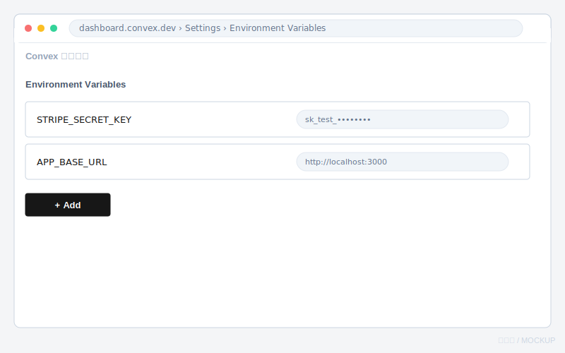

✅ **確認ポイント**：Environment Variables に2行（`STRIPE_SECRET_KEY` と `APP_BASE_URL`）が並んでいる。

---

## ステップ3：Vercel に画面を公開する

ここでは **Vercel CLI**（ターミナルから公開する方法）で進めます。

### 3-1. Vercel CLI を入れてログイン

```bash
npm install -g vercel
vercel login
```

メールアドレスを入れ、届いた確認メールのリンクを押すとログイン完了です。

### 3-2. プロジェクトを Vercel に作る

プロジェクトフォルダで：

```bash
vercel link
```

- 「Set up and deploy?」→ **Yes / Link to existing? No / 新規作成**
- プロジェクト名は `gaslab-order` などでOK（質問はだいたい Enter で進めて大丈夫）

> 📸 **[3-2] vercel link 完了**
> `Linked to ...` と表示されたターミナルを撮影。
> → `images/3-2.svg`

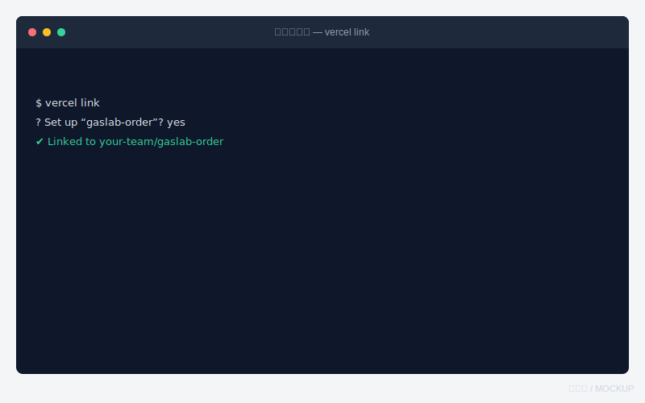

### 3-3. 公開する（プレビルドSPA方式）

このアプリは TanStack Start の **SPA**（画面はブラウザで描画）です。Vercel には SSR アダプタが無いため、**手元でビルドして成果物だけアップする「プレビルド方式」**で公開します（**Convex Deploy Key は不要**）。

まず Convex にログインしておきます（初回だけ）。

```bash
npx convex login        # ブラウザで GitHub/Google 認証 → Approve
./scripts/deploy.sh
```

`./scripts/deploy.sh` が次を**自動**でやります。

1. Convex 本番へデプロイ＋クライアントを本番URLでビルド
2. SPA 用に成果物（`.vercel/output`）を組み立て
3. Vercel へプレビルド公開
4. 主要ルートが 200 か検証

最後に `✅ デプロイ完了: https://〇〇.vercel.app` と出れば**公開成功**。これがあなたのアプリです。

> 💡 検証用URLが自分のプロジェクトのドメインと違うときは
> `PUBLIC_URL=https://〇〇.vercel.app ./scripts/deploy.sh` で上書きできます。

> 📸 **[3-3] デプロイ完了・公開URL**
> `✅ デプロイ完了: https://〇〇.vercel.app` が出たターミナルを撮影。
> → `images/3-3.svg`


> 🛈 なぜこの方式？ TanStack Start のこのバージョンには Vercel 用 SSR アダプタが無く、
> 普通の `vercel --prod`（クラウドビルド）では静的化されて全ルート 404 になります。
> 当アプリはサーバー専用機能を持たない（データは Convex とクライアント通信）ため、
> **SPA＋プレビルド**が最も堅実です。旧来の「Deploy Key＋`vercel --prod`」方式は
> **付録G**に参考として残しています。詳細は `docs/sessions/2026-06-28-本番デプロイとSPA化.md`。

### 3-4. APP_BASE_URL を本物のURLに直す

ステップ2-3で仮に入れた `APP_BASE_URL` を、いま出た Vercel のURLに変更します。

- **Convex ダッシュボード → Settings → Environment Variables → `APP_BASE_URL`** を編集
- 値を `https://〇〇.vercel.app`（末尾スラッシュなし）に

> 📸 **[3-5] APP_BASE_URL を更新**
> `APP_BASE_URL` が Vercel のURLになっている画面を撮影。
> → `images/3-5.svg`

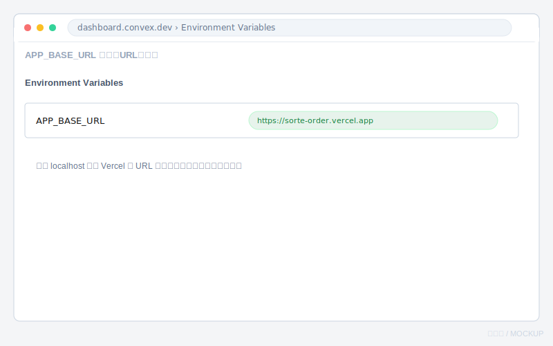

✅ **確認ポイント**：ブラウザで `https://〇〇.vercel.app` を開くと、「卓注文アプリ」の入口画面が出る。

---

## ステップ4：動作確認（注文 → キッチン → テスト決済）

### 4-1. デモデータを入れる

公開URL（入口画面）の下のほうにある **「デモデータ投入」** ボタンを押します。
店舗「トラットリア ガスラボ」と卓・メニューが入ります。

> 📸 **[4-1] 入口画面（公開後）**
> 公開URLの入口画面を撮影。
> → `images/4-1.png`

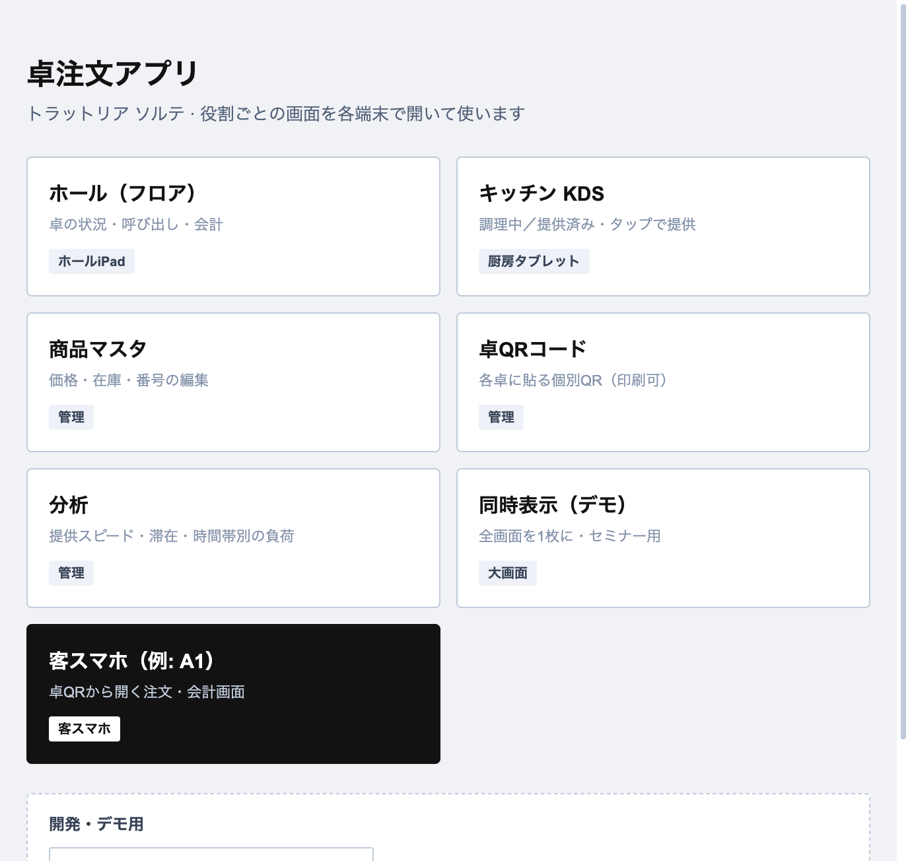

### 4-2. 2画面を並べてリアルタイムを体験

- ブラウザのタブを2つ開く
  - タブA：入口の **「客スマホ（例: A1）」** → 注文画面
  - タブB：**「キッチン KDS」**
- タブAで「注文を始める」→ メニュー番号（例 `2003`）を入力 → 「注文追加」→「注文する」
- タブBのキッチンに**すぐ**注文が出れば成功 🎉

> 📸 **[4-2] 客スマホとキッチンの同期**
> 注文がキッチンに出た瞬間（2画面）を撮影。
> → `images/4-2.png`

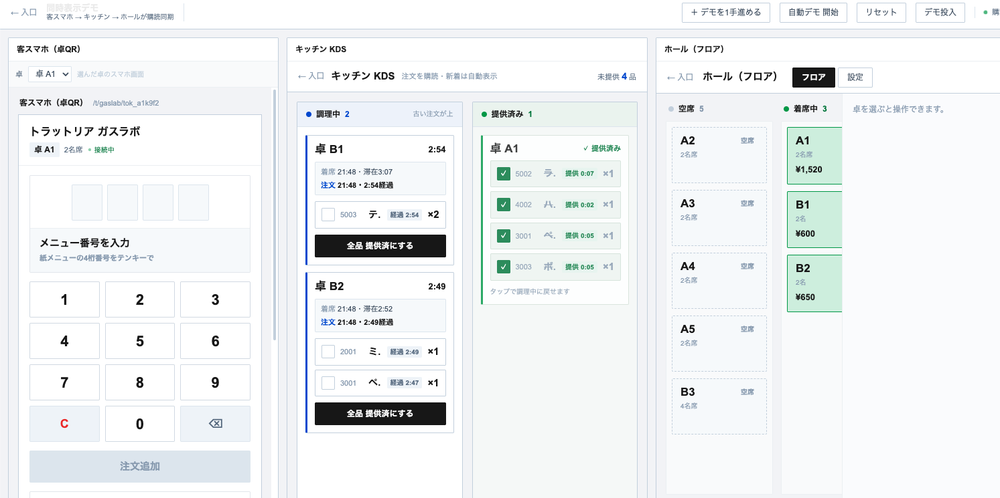

### 4-3. テスト決済を試す

客スマホで「会計へ進む」→「会計する」を押すと Stripe の決済画面が開きます。
**テスト用カード番号**で支払えます（実際のお金は動きません）。

- カード番号：`4242 4242 4242 4242`
- 有効期限：未来の日付（例 `12/34`）／ CVC：任意の3桁（例 `123`）／ 名前・郵便番号：任意

> 📸 **[4-3] Stripe テスト決済画面**
> `4242...` を入れた Stripe Checkout 画面を撮影。
> → `images/4-3.svg`

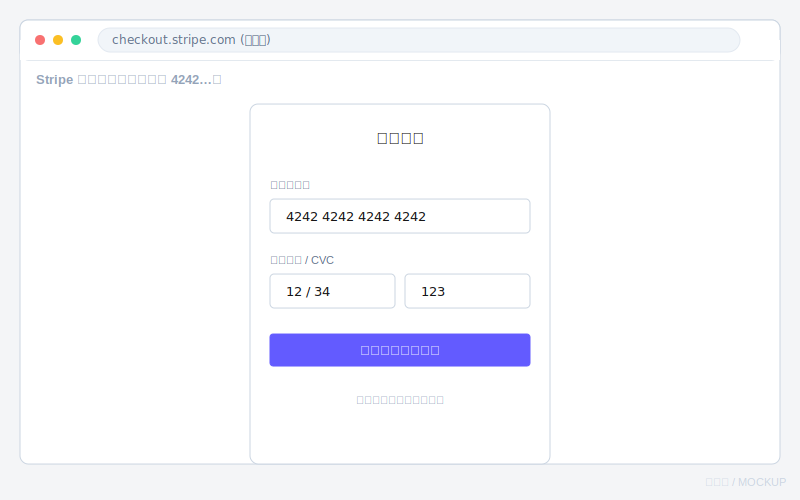

支払い後、客スマホが「お支払いを確認しています…」と出ます。
**完全に「会計済み」まで自動で進めるには、付録Aの Webhook 設定が必要です**（テスト体験だけならここまででOK）。

---

## うまくいかないとき（よくあるつまずき）

| 症状 | 原因・対処 |
|---|---|
| `node -v` でエラー | Node.js が未インストール。<https://nodejs.org/> の LTS を入れる |
| `npm install` で赤いエラー | フォルダを間違えている可能性。`gaslab-order` フォルダの中で実行しているか確認 |
| 入口は出るが「店舗未設定」 | 「デモデータ投入」を押す／Convex のデプロイが終わっているか確認 |
| 会計ボタンで「会計の開始に失敗」 | Convex の `STRIPE_SECRET_KEY` が未設定・打ち間違い。ステップ2-3を見直す |
| 決済後に「会計済み」にならない | 正常。完全自動化には**付録A（Webhook）**が必要 |
| Vercel デプロイが失敗 | `./scripts/deploy.sh` をプロジェクトフォルダで実行しているか確認。`npx convex login` 済みか、`vercel link` 済みか |

---

## 付録（任意・余裕があれば）

簡易版は「ステップ4」まででOKです。以下は本番運用に近づけたい人向け。

### 付録A：Stripe の Webhook（任意・より速い会計完了）

> **標準手順では Webhook は不要です。** テスト決済後、客スマホが Stripe から戻るとアプリが支払い状態を自動確認し、会計済みにします。Webhook は Stripe から裏側で即通知させたい場合の追加設定です。

決済完了を Stripe からアプリに通知させ、卓を自動で「会計済み」にします（客が戻る前でも反映）。

1. Convex の HTTP アドレスを確認：**Convex ダッシュボード → Settings → URL & Deploy Key** の
   **HTTP Actions URL**（`https://〇〇.convex.site`）
2. **Stripe ダッシュボード（テスト）→ 開発者 → Webhook → エンドポイントを追加**
   - URL：`https://〇〇.convex.site/stripe/webhook`
   - イベント：`checkout.session.completed` と `checkout.session.expired`
   - ※ Stripe の UI 改定で「URL 入力」と「イベント選択」の**順序が前後する**ことがあります。同じ追加画面内の操作なので、どちらを先にしてもOK。
   - 📸 **[A-1]** Webhook 追加画面 → `images/A-1.svg`
3. 作成後に出る **署名シークレット**（`whsec_...`）をコピー
4. **Convex の Environment Variables** に `STRIPE_WEBHOOK_SECRET` = `whsec_...` を追加
   - 📸 **[A-2]** 追加後の画面 → `images/A-2.svg`

これで、決済後に客スマホが自動で「お会計が完了しました」に変わります。

### 付録B：会計メール（Resend）— デフォルトではオフ

> **このセミナーの標準手順では領収メールは送りません。** コード（`emails.sendReceipt`）は配線済みですが、Resend の API キー未設定・Checkout でメール未入力のため**休眠状態**です。会計完了画面にメールが来ないのは正常です。

有効化したい場合のみ、次を設定します。

1. <https://resend.com> でサインアップ → API キー（`re_...`）を発行 📸 **[B-1]**
2. Convex の Environment Variables に
   - `RESEND_API_KEY` = `re_...`
   - `RESEND_FROM` = 送信元（例 `onboarding@resend.dev`）
3. Stripe Checkout で客がメールアドレスを入力する設定（Webhook 経由で捕捉）

### 付録C：PayPay を有効化（任意）

既定の Checkout は**カードのみ**です。PayPay も並べたい場合:

1. Stripe ダッシュボード（テスト）→ **設定 → 支払い方法** で **PayPay** をオン 📸 **[C-1]**
2. Convex の Environment Variables に `STRIPE_ENABLE_PAYPAY` = `true` を追加（**Production**）
3. 再度デプロイ後、会計画面に PayPay が並びます（テスト環境で挙動を確認できます）

### 付録D：卓QRの表示（占有ロック方式・重要）

> ⚠️ **このアプリは「占有ロック＋QR自動再生成」方式です。**
> 1卓1端末で、退店 →「清掃完了」を押すと **その卓のQR（トークン）が自動で新しくなり、古いQRは無効**になります（退店客の履歴やスクショからの再入を防ぐため）。
> このため **固定の紙QRを貼りっぱなしにはできません**（清掃のたびにQRが変わる）。

運用は次のどちらかになります。

- **(a) 動的表示（推奨）**：各卓に **E-paper や小型タブレット**を置き、`/qr` のその卓の**現行QRを常時表示**。清掃完了で自動更新されるので貼り替え不要。
- **(b) 簡易運用（デモ向け）**：紙でも可。ただし**清掃完了のたびに**スタッフが `/qr` で最新QRを表示／印刷し直します。

`/qr` は QR にドメインを含めるため、必ず**公開後の `https://〇〇.vercel.app/qr`** を開いてから使ってください（ローカルのまま印刷するとスマホで読めません）。利用中・清掃中の卓は**グレーアウト**表示されます。📸 **[D-1]**

### 付録E：不正注文・再注文の対策（実装済み）

占有ロック（1卓1端末）＋QR再生成により、次は**塞がれています**：

- 退店した客が再読込や履歴から**再注文すること**
- 会計済みの卓に**別の客が相席で入って注文すること**
- 退店後に空いた卓へ、古いQR/スクショから**再入すること**（清掃完了でトークン失効）

残る前提：**占有中の現行QRをその場で見せ合えば同席者も入れます**（ただし注文できるのは claim を持つ1端末に制限）。引き続き**店内限定運用**が前提です。

**デモ・検証で起きやすいこと**：端末のブラウザデータ（localStorage）を消すと、占有端末本人も「利用中」で戻れなくなる。対処は **`resetDemo`（分析画面または入口）** またはホール `/floor` からスタッフが **`openSession` で卓を解放**する。

### 付録F：会計後・店内の新しい挙動（参考）

- **客スマホ**：会計が完了すると数秒後に「**ありがとうございました**」画面へ自動で切り替わります（※タブの物理的な自動クローズはブラウザ仕様上できないため、この画面が最終表示です）。
- **/qr**：利用中＝「利用中」、清掃中＝「清掃中」でQRを伏せてグレーアウト。
- **卓のライフサイクル**：会計済み（open のまま）→ `/floor` で「**退店**」→「**清掃完了**」で **QR再生成＝次の客の受け入れ準備完了**。

### 付録G：旧デプロイ方式（Deploy Key ＋ `vercel --prod`）※参考

> ⚠️ **現在の標準はステップ3のプレビルドSPA方式（`./scripts/deploy.sh`）です。** 以下は参考記録。
> この方式は Vercel の**クラウドビルド**で `npx convex deploy --cmd 'npm run build'` を走らせるもので、
> このアプリ（SSR アダプタ無しの SPA）では**静的化されて全ルート 404 になる**ため、そのままでは使えません。
> 仕組みと経緯は `docs/sessions/2026-06-28-本番デプロイとSPA化.md` を参照。

旧手順の骨子（歴史的経緯としての記録）:

1. **Convex 本番デプロイキー**を発行：Convex ダッシュボード → Settings → URL & Deploy Key → **Production** → Generate Production Deploy Key。
2. Vercel に登録：`vercel env add CONVEX_DEPLOY_KEY`（対象 Production）。
3. 公開：`vercel --prod`（クラウドでビルド＝このとき Convex 本番デプロイも自動実行）。

→ クラウドビルドで SSR を正しく関数化できないのが本質的な問題のため、**プレビルド方式に移行済み**。

---

## 公開後によく使うコマンド早見表

```bash
# 画面・頭脳をまとめて再公開（このリポジトリの標準。SPA/プレビルド方式）
./scripts/deploy.sh

# 環境変数を後から変える（ダッシュボードでもOK）
npx convex env set 名前 値 --prod
```

> 📝 このリポジトリは **SPA（クライアントレンダリング）＋プレビルド公開** に最適化されており、再公開は
> `./scripts/deploy.sh`（手元でビルド→成果物だけアップ＝Convex Deploy Key 不要）にまとまっています。
> 旧来の「Deploy Key ＋ `vercel --prod`」方式は**付録G**に参考として残しています（経緯は
> `docs/sessions/2026-06-28-本番デプロイとSPA化.md`）。

おつかれさまでした。これで自分の卓注文アプリが世界に公開されています 🎉
