# 卓注文アプリ 公開手順書（ステップ3〜6・テストモード）

客スマホ・キッチン・ホールが**リアルタイムに同期**する卓注文アプリを、
自分のアカウントで**インターネットに公開**し、**Stripe のテスト決済**まで動かす手順です。

> 🔰 **先に読む資料があります**
> はじめての方は [クローンから自分用環境をつくる.md](クローンから自分用環境をつくる.md)（＝ステップ1〜2）を先に終えてください。
> **この README は、その続き＝ステップ3〜6** です。

- **むずかしさ**：上から順にコピペで進めれば公開できます（プログラミング知識は不要）
- **お金**：この範囲はすべて**無料／テストモード**（実際のお金は動きません）
- **かかる時間**：約 40〜60 分（**セミナー後**に自分のペースで）
- **ゴール**：`https://〇〇.vercel.app` で自分のお店の卓注文アプリが動く

---

## 🗺 全6ステップの地図（いまどこ？）

| # | やること | ひとことで言うと | どの資料 |
|---|---|---|---|
| 1 | コードを取得（`git clone`） | ネット上のコードを自分のPCにコピー | [クローン資料](クローンから自分用環境をつくる.md) |
| 2 | 部品をインストール（`npm install`） | アプリが動く部品を集める | [クローン資料](クローンから自分用環境をつくる.md) |
| **3** | Convex（頭脳）をクラウドに置く | データと注文ロジックの置き場を用意 | **👉 いまここ** |
| **4** | Stripe（テスト決済）を接続 | 支払い機能をつなぐ（お金は動かない） | **👉 この資料** |
| **5** | Vercel（画面）を公開 | ネットに自分のURLで画面を出す | **👉 この資料** |
| **6** | 動作確認 | 注文→キッチン→テスト決済を試す | **👉 この資料** |

> 💡 用語はそのつど「かんたんに言うと」を添えます。いま全部おぼえる必要はありません。

---

## 🖼 このアプリの仕組み（絵で見る）

3つの部品でできています。

```
   あなたのPC（コード）
        │  ステップ3：Convex に「頭脳（データ・注文ロジック）」を置く
        ▼
   Convex（クラウド・無料）  ←── ステップ4：Stripe（テスト決済）を接続
        │  ステップ5：Vercel に「画面」を置いて公開
        ▼
   Vercel（公開URL・無料）  →  お客さん・スタッフがブラウザで開く
```

- **Convex** ＝ データと注文の処理をあずかる「頭脳」（クラウド）
- **Stripe** ＝ 支払いの仕組み（今回はテストモードなので本物のお金は動かない）
- **Vercel** ＝ 画面をネットに出して、URLで開けるようにする場所

---

## 🧰 用意するもの（ステップ1〜2から続けていれば揃っています）

- パソコン（Mac / Windows）とインターネット
- **このプロジェクトのフォルダ** … [クローン資料](クローンから自分用環境をつくる.md)で取得済みのはず
- **Node.js**（20 LTS 推奨・v18 以上でも可）… `node -v` で確認
- **GitHub アカウント** … **必須ではありません**（clone は公開リポなので不要／Convex ログインは Google でも可）。持っていれば Convex ログインに使える、という程度です
- 無料アカウント3つ（この手順の中で作ります）
  - **Convex** <https://convex.dev> ／ **Stripe** <https://stripe.com/jp>（テストモードのみ）／ **Vercel** <https://vercel.com>

> 🖥 **ターミナルの開き方**（＝コマンドを打つ黒い画面）
> - Mac：アプリ「ターミナル」／ Windows：**Git Bash**（`./scripts/deploy.sh` は PowerShell では動きません）
> - どちらも**クローンしたプロジェクトフォルダの中**で開いてください。

> 💡 **画像について**：本文の各所に**仮のイメージ図（SVG）**と一部**実スクショ（PNG）**があります（`images/`）。
> 自分で撮った画面に差し替えてもOK。差し替え方：PNG を `images/` に置き、本文の `` を `.png` に変える。

---

## （念のため）ステップ2：`npm install` が未実施なら先に実行

[クローン資料](クローンから自分用環境をつくる.md)で済んでいれば飛ばしてOK。未実施のときだけ：

```bash
npm install
```

> 📸 **[0-1] インストール完了** … `added 〇〇 packages` と出た画面 → `images/0-1.svg`

---

## ステップ3 ／ 6：Convex（頭脳）をクラウドに置く

> 🎯 **このステップのゴール**：Convex のダッシュボードに自分のプロジェクトができ、本番デプロイも1回済んでいる状態。

### 3-1. Convex にログイン

```bash
npx convex login
```

ブラウザが開きます。**Google または GitHub のどちらか一方**を選んでログインします（下の画面）。

> 💡 **コツ：ログイン方法は最初に決めて、ずっと同じものを使う。**
> Convex も、あとで使う Vercel も、**毎回おなじ方法**（例：Google）でログインしてください。
> 途中で Google と GitHub を混ぜると、**別々のアカウントが2つ**できてプロジェクトが迷子になります。

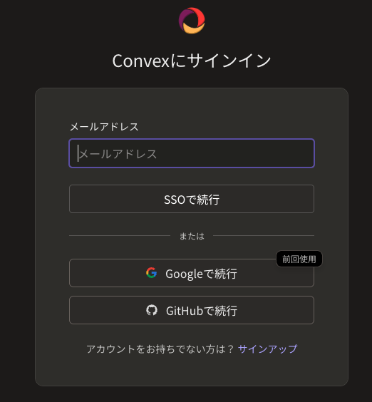

ログイン方法を選ぶと、続けて **「デバイス認証」** 画面が出ます。
ターミナルに表示されているコードと**同じか確認**して、**「確認（Approve）」** を押します。
ターミナルに `Logged in`（ブラウザは「設定完了です！」）と出れば成功です。

> 📸 **[1-1] デバイス認証（Approve）** … ターミナルのコードと一致を確認して「確認」 → `images/1-1.png`

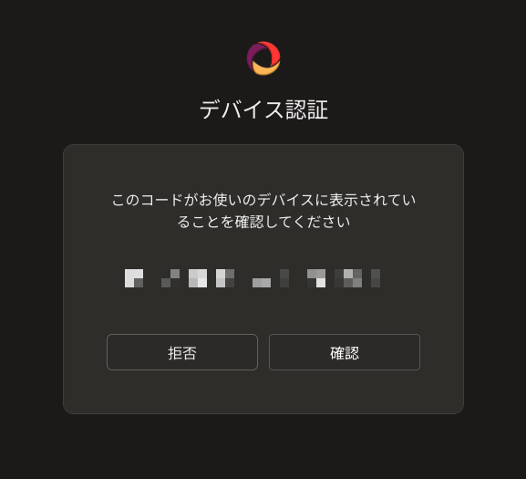

### 3-2. クラウドにプロジェクトを作る

```bash
npx convex dev --configure new --project gaslab-order
```

いくつか質問されます。落ち着いて次の通りに：

- **Team を選ぶ** … 1人だけなら候補が1つ。そのまま **Enter**。
  - Team の名前は **slug（英数字・ハイフンだけ）** を使います。日本語の表示名を貼ると文字化けすることがあります。
  - slug は [Convex ダッシュボード](https://dashboard.convex.dev) 左上の Team 名の横、または Settings で確認できます。
- **リージョン（場所）を聞かれたら** … 「`US East (N. Virginia)`」を選ぶ（最初から選ばれているので **Enter**）。
  - アジアは選択肢に無く、US East が Convex の標準です。デモのリアルタイム同期は十分速いです。
- `Convex functions ready!` と出て**接続待ち**になったら、**`Ctrl+C` で止める**。
  - これで設定ファイル `.env.local` がクラウド向けに書き換わります（止めないと次に進めません）。

> 💡 **すでにローカルで `npx convex dev` を動かした人へ**：上の `--configure new` で**クラウドに作り直す**のが大事です（ローカルのままだと公開できません）。

<details>
<summary>質問に手で答えず、コマンドで一発指定したい場合</summary>

```bash
# YOUR_TEAM_SLUG は自分の slug に置き換え（日本語は不可）
npx convex dev --configure new --team YOUR_TEAM_SLUG --project gaslab-order
```
</details>

> 📸 **[1-2] プロジェクト作成完了** … `Created project …` と、接続情報が `.env.local` に保存された画面 → `images/1-2.png`

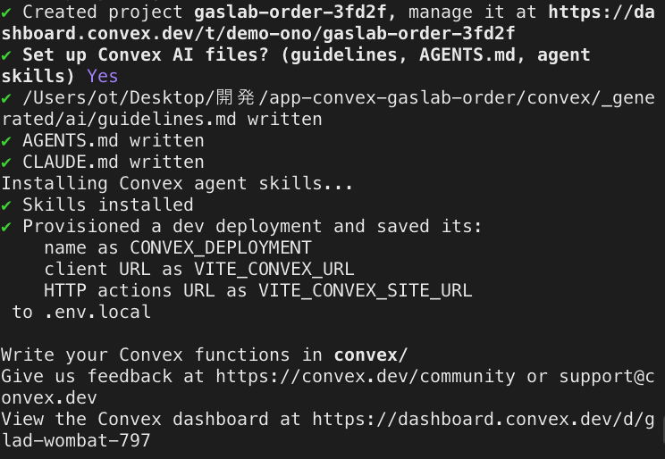

続けて、**本番用のデプロイ**を1回作ります（あとで Vercel が使います）：

```bash
npx convex deploy
```

`Deployed Convex functions` と出れば本番側の準備 OK。

> 📸 **[1-2b] 本番デプロイ完了** … `Deployed Convex functions to …convex.cloud`（テーブル索引の追加も一覧表示）→ `images/1-2b.png`

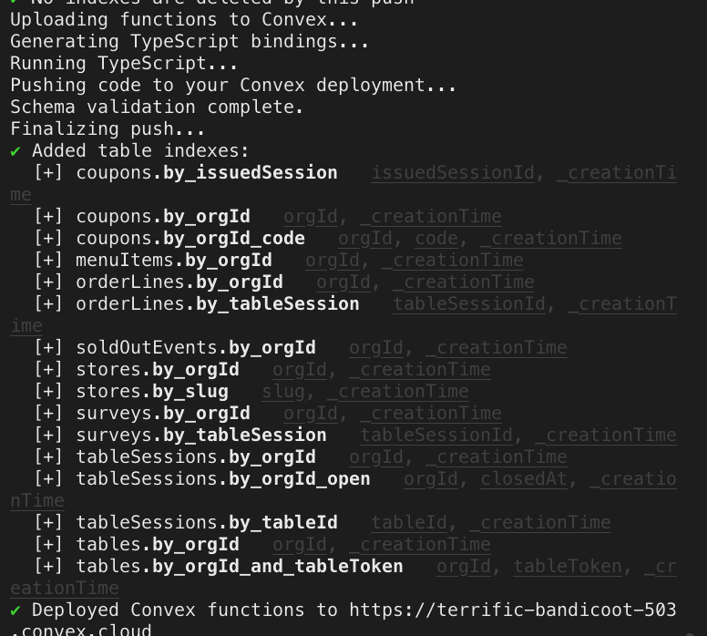

### 3-3. Convex ダッシュボードを開いておく

ブラウザで <https://dashboard.convex.dev> を開き、いま作った `gaslab-order` を開きます。
**あとでキーを入れるので、このタブは開いたままに。**

> 📸 **[1-3] Convex ダッシュボード** … `gaslab-order` プロジェクトが並ぶ画面（このタブは開いたままに）→ `images/1-3.png`

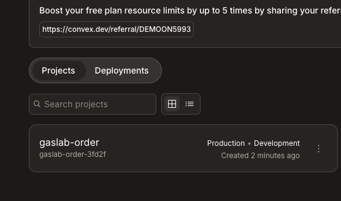

> ✅ **ステップ3の確認**：ダッシュボードの「Data」を開くと、`tables` `menuItems` などの表が並んでいる。

---

## ステップ4 ／ 6：Stripe（テスト決済）を接続する

> 🎯 **このステップのゴール**：Convex の**本番（Production）**に、Stripe のテストキーと `APP_BASE_URL` が入っている状態。

> 🔁 Stripe と Convex を行き来して値を渡します。**どの値をどっちに入れるか**は
> [stripe-convex-フロー.md](stripe-convex-フロー.md) の図がわかりやすいです。

### 4-1. Stripe を開き、「テストモード」を確認

<https://dashboard.stripe.com> を開き、右上が **「テスト環境／テストモード」** になっているか**必ず**確認します。
（本番モードだと実際に課金されてしまいます）

> 📸 **[2-1] Stripe テストモードの確認** … 右上トグルがテスト側 → `images/2-1.png`

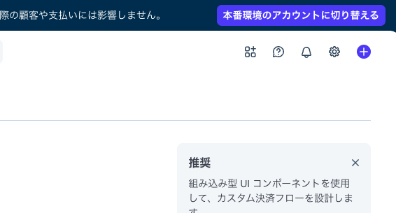

### 4-2. テスト用のシークレットキーをコピー

左メニュー（または右上）の **開発者 → API キー** を開き、
**シークレットキー**（`sk_test_` で始まる）の「表示」を押してコピーします。

> 📖 **シークレットキーとは**：アプリが Stripe に「これは私です」と伝えるための合言葉。**パスワードと同じ**なので人に見せない。

> 📸 **[2-2] Stripe API キー画面** … `sk_test_...` が見える画面（キー本体は隠して保存推奨） → `images/2-2.png`

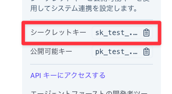

### 4-3. Convex にキーを登録（★必ず「本番＝Production」側へ）

> ⚠️ **いちばんのつまずきポイント：dev（開発）と prod（本番）を間違えない**
> 公開アプリ（Vercel）が使うのは Convex の **本番（Production）**。
> dev 側に入れても本番には効かず、会計で「開始に失敗」になります。**「Production」の文字を必ず目で確認**してください。

**方法A：ダッシュボードで入れる（おすすめ・目で確認できる）**

1. Convex ダッシュボード上部の**デプロイ切替**で **「Production」** を選ぶ
2. **Settings → Environment Variables → Add** を開く（画面に `Production` と出ているか確認）
3. 次の2つを**1つずつ手で**登録します。**変数名は下のコードブロック右上のコピーボタンでコピー**して、Convex の「Name」欄にそのまま貼れます（打ち間違い防止）。値は自分のものを入れます。

   **① 1つ目** — 下の名前を「Name」に貼り、値は コピーした `sk_test_...`：

   ```
   STRIPE_SECRET_KEY
   ```

   **② 2つ目** — 下の名前を「Name」に貼り、値は いまは仮で `http://localhost:3000`（**ステップ5-4で本物のURLに直します**）：

   ```
   APP_BASE_URL
   ```

<details>
<summary>方法B：コマンドで入れる（<code>--prod</code> を必ず付ける）</summary>

```bash
# gaslab-order フォルダの中で実行
npx convex env set STRIPE_SECRET_KEY sk_test_... --prod
```

- `Successfully set ... (on prod deployment ...)` と **prod** が出れば OK。`--prod` を忘れると dev に入ってしまいます。
- 確認：`npx convex env list --prod` に `STRIPE_SECRET_KEY` が並ぶ。
</details>

> 📸 **[2-3] Convex 環境変数（Production）** … 画面上部が `Production` で、2つの変数が並ぶ（値は隠してOK） → `images/2-3.png`

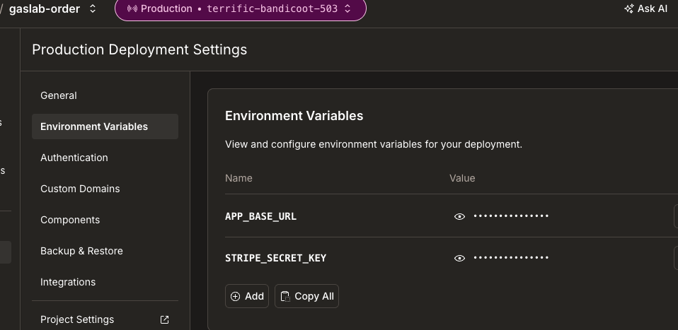

> ✅ **ステップ4の確認**：Environment Variables に2行（`STRIPE_SECRET_KEY` と `APP_BASE_URL`）が **Production 側に**並んでいる。

---

## ステップ5 ／ 6：Vercel に画面を公開する

> 🎯 **このステップのゴール**：`https://〇〇.vercel.app` が発行され、ブラウザで入口画面が開ける状態。

**Vercel CLI**（ターミナルから公開する方法）で進めます。

### 5-1. Vercel CLI を入れてログイン

```bash
npm install -g vercel
vercel login
```

方法の一覧が出たら、**Google（onodemo01 と同じ Gmail）を選ぶ**（Convex と同じ人格でそろえる）。
ブラウザで **「Authorize Device（デバイスの認証）」** 画面が開くので、コードを確認して **「Allow」** を押します。

> 📸 **[3-1] Vercel デバイス認証** … コードを確認して「Allow」 → `images/3-1.png`

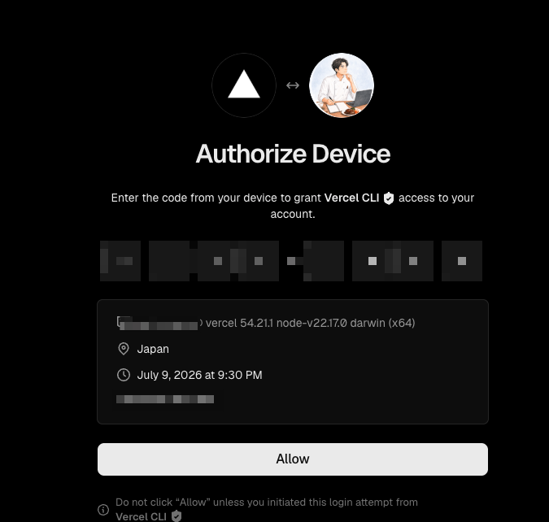

**「Authorization Successful」** と出れば、ターミナルもログイン完了です。

> 📸 **[3-1b] Vercel ログイン完了** … `Authorization Successful` → `images/3-1b.png`

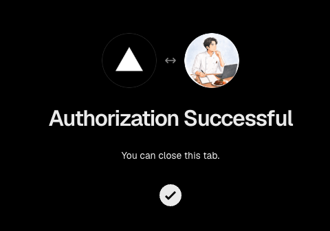

複数アカウントを使っている人は、**今どのアカウントか**を必ず確認します。

```bash
npx vercel whoami
```

想定と違うアカウント名なら、`vercel logout` → `vercel login` で切り替えてください。

### 5-2. プロジェクトを Vercel に作る

プロジェクトフォルダで：

```bash
vercel link
```

- 「Set up and deploy?」→ **Yes**、「Link to existing?」→ **No**（新規作成）
- プロジェクト名は `gaslab-order` などで OK（あとの質問はだいたい **Enter** で大丈夫）

> 📸 **[3-2] vercel link 完了** … `Linked to ...` と出たターミナル → `images/3-2.png`

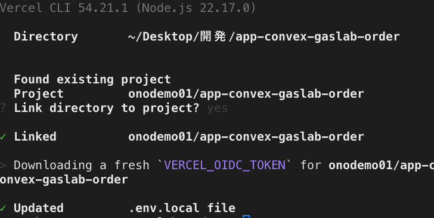

### 5-3. 公開する

まず Convex にログインしておきます（初回だけ）。そのあと公開スクリプトを実行します。

```bash
npx convex login        # ブラウザで GitHub/Google 認証 → Approve
./scripts/deploy.sh
```

このスクリプトが、公開に必要な作業（ビルド〜アップ〜動作チェック）を**まとめて自動**でやってくれます。
最後に **`✅ デプロイ完了: https://〇〇.vercel.app`** と出れば**公開成功**。これがあなたのアプリのURLです。

<details>
<summary>アカウント事故を防ぎたい／なぜこの方式なのか</summary>

**想定アカウントを固定して実行**（別アカウントに公開する事故を防ぐ）：

```bash
EXPECTED_VERCEL_USER=YOUR_VERCEL_USER ./scripts/deploy.sh
```

検証用URLが自分のドメインと違うときは `PUBLIC_URL=https://〇〇.vercel.app ./scripts/deploy.sh` で上書きできます。

`./scripts/deploy.sh` が自動でやること：① Convex 本番へデプロイ＋本番URLでビルド ② 成果物（`.vercel/output`）を組み立て ③ Vercel へアップ ④ 主要ルートが 200 か検証。

**なぜ普通の `vercel --prod` を使わない？** このアプリは画面をブラウザ側で描く方式（SPA）で、この構成では普通のクラウドビルドだと全ページが 404 になってしまいます。そこで**手元でビルドして成果物だけアップする「プレビルド方式」**を採用しています（Convex Deploy Key も不要）。旧方式は**付録G**に参考として残しています。詳細は `docs/sessions/2026-06-28-本番デプロイとSPA化.md`。
</details>

> 📸 **[3-3] デプロイ完了・公開URL** … `✅ デプロイ完了: https://〇〇.vercel.app` → `images/3-3.png`

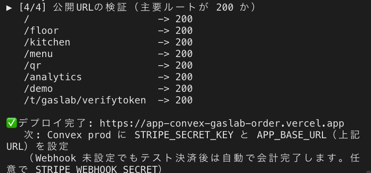

### 5-4. `APP_BASE_URL` を本物のURLに直す（忘れやすい！）

ステップ4-3で**仮に**入れた `APP_BASE_URL` を、いま出た Vercel のURLに変更します。
（ここを直さないと、会計後にうまく戻ってこられません）

1. **Convex ダッシュボード → Settings → Environment Variables → `APP_BASE_URL`** を編集
2. 値を `https://〇〇.vercel.app`（**末尾スラッシュなし**）に

> 📸 **[3-5] APP_BASE_URL を更新** … Vercel のURLになった画面 → `images/3-5.svg`


> ✅ **ステップ5の確認**：ブラウザで `https://〇〇.vercel.app` を開くと「卓注文アプリ」の入口画面が出る。

---

## ステップ6 ／ 6：動作確認（注文 → キッチン → テスト決済）

> 🎯 **このステップのゴール**：注文がキッチンにリアルタイムで出て、テストカードで会計まで通る。

### 6-1. デモデータを入れる

公開URL（入口画面）の下のほうにある **「デモデータ投入」** ボタンを押します。
店舗「トラットリア ガスラボ」と卓・メニューが入ります。

> 📸 **[4-1] 入口画面（公開後）** … 公開URLの入口画面 → `images/4-1.png`


### 6-2. 2画面を並べてリアルタイムを体験

- ブラウザのタブを2つ開きます
  - **タブA**：入口の「**客スマホ（例: A1）**」→ 注文画面
  - **タブB**：「**キッチン KDS**」（＝厨房用の注文表示画面）
- タブAで「注文を始める」→ メニュー番号（例 `2003`）を入力 →「注文追加」→「注文する」
- **タブBのキッチンに、すぐ注文が出れば成功** 🎉

> 📖 **KDS とは**：Kitchen Display System＝厨房のモニターに注文を映す仕組みのこと。

> 📸 **[4-2] 客スマホとキッチンの同期** … 注文がキッチンに出た瞬間（2画面） → `images/4-2.png`


### 6-3. テスト決済を試す

> ⚠️ **決済テストは「実機（スマホでQR）」か「新しいタブに直接URL」で行う。管理画面のプレビュー枠の中ではダメ。**
> プレビューはお客さん画面を**枠（iframe）の中に埋め込んで**表示しています。Stripe の決済ページは
> セキュリティ仕様で**枠の中では絶対に開かず、真っ白**になります（コンソールに `Stripe Checkout is not able to run in an iFrame`）。
> これは**バグではありません**。実際のお客さんは QR をカメラで読んで画面全体で開くので問題なく決済できます。

客スマホで「会計へ進む」→「会計する」を押すと Stripe の決済画面が開きます。
**テスト用カード番号**で支払えます（実際のお金は動きません）。

- カード番号：`4242 4242 4242 4242`
- 有効期限：未来の日付（例 `12/34`）／ CVC：任意の3桁（例 `123`）／ 名前・郵便番号：任意

> 📸 **[4-3] Stripe テスト決済画面** … `4242...` を入れた Checkout 画面 → `images/4-3.png`

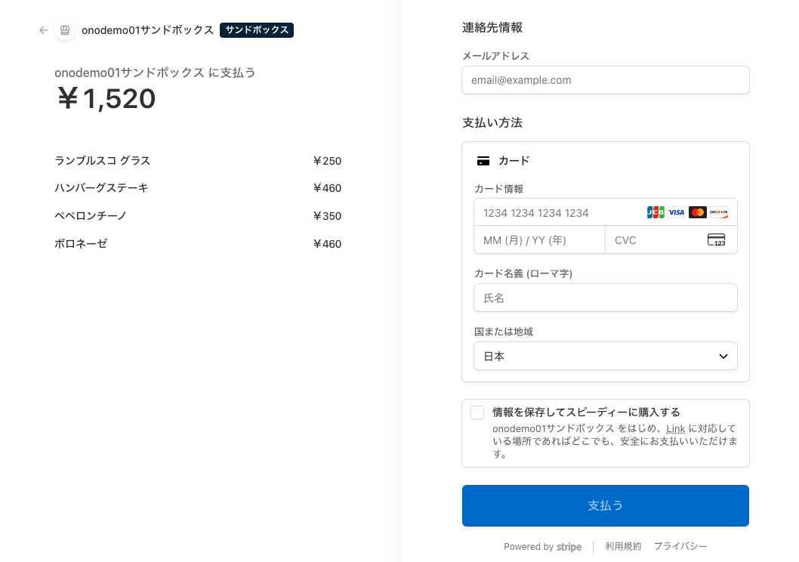

支払い後、客スマホが「お支払いを確認しています…」と表示し、数秒で自動的に会計済みへ切り替わります。

> 🔔 **この自動確認は「客がこの画面に戻ってきた」ときだけ動きます。** スマホのお客さんは支払い後に
> タブを閉じて**戻ってこないことも多く**、その場合この自動確認は走りません。**支払ったのに確実に
> 「会計済み」にするには、Webhook（下の付録A・推奨）を設定してください。**人に使わせる/本番では実質必須です。

> 📸 **[4-3b] 会計完了** … 客スマホが「お会計が完了しました」に切り替わった画面（続けてアンケート→次回クーポン）→ `images/4-3b.png`

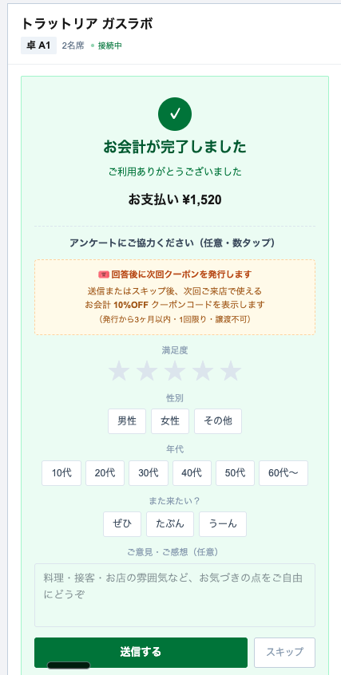

<details>
<summary>（任意）決済が Stripe と Convex に反映されたか、裏側でも確認する</summary>

- **Stripe ダッシュボード（テスト）**：支払いが売上として記録されます（手数料を引いた**純売上**が表示）。

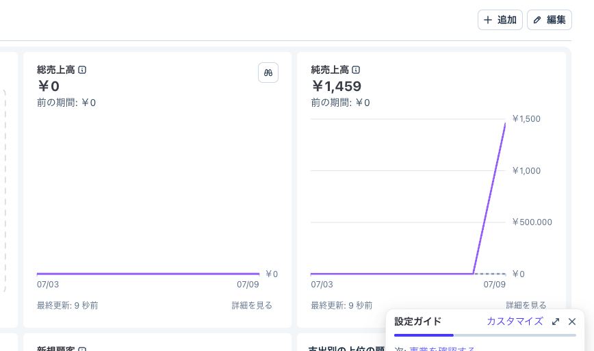

- **Convex ダッシュボード → Data**：その卓のセッションに支払い金額（`finalChargeAmount`）と Stripe の支払いID（`finalPaymentIntentId`）が入ります。

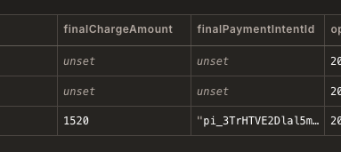

これで「**客スマホ → Stripe → Convex**」の配線がすべて正しいと確認できます。
</details>
切り替わらないときは、まずページを再読込し `APP_BASE_URL`（`https://` 付き・末尾スラッシュ無し）/ `STRIPE_SECRET_KEY` を確認。**それでも直らない・客が戻ってこない運用なら Webhook（付録A・推奨）を設定します。** Webhook 設定済みなのに切り替わらないときは、登録した URL の末尾に **`/stripe/webhook` が付いているか**を必ず確認してください（付録A の 🚨 参照）。

> ✅ **ステップ6の確認（＝全部完了！）**：注文がキッチンに出て、テストカードで会計が「会計済み」になった。
> 🎉 これで**自分の卓注文アプリがインターネットに公開されました。**

---

## 🆘 うまくいかないとき（よくあるつまずき）

| 症状 | 原因・対処 |
|---|---|
| `node -v` でエラー | Node.js が未インストール。<https://nodejs.org/> の LTS を入れる |
| `npm install` で赤いエラー | フォルダ違いかも。`gaslab-order` フォルダの**中**で実行しているか確認 |
| `npx convex` で進めない | まず `npx convex login` 済みか。`Approve` を押したか |
| 入口は出るが「店舗未設定」 | ステップ6-1の「デモデータ投入」を押す／Convex のデプロイが終わっているか |
| 会計ボタンで「会計の開始に失敗」 | `STRIPE_SECRET_KEY` が**本番（Production）**に入っていない or 打ち間違い。**ステップ4-3を見直す** |
| 決済後に「会計済み」にならない | ①まずページ再読込。②`APP_BASE_URL`（`https://`付き・末尾スラッシュ無し）/ `STRIPE_SECRET_KEY` を見直す。③**客が支払い後に画面へ戻らない運用なら Webhook（付録A・推奨）を設定**。④Webhook 設定済みなのにダメなら、登録 URL の末尾 **`/stripe/webhook` が抜けていないか**を確認（ドメインだけだと Stripe は成功表示でもアプリに届かない・付録A🚨） |
| 管理画面プレビューで会計を押すと真っ白 | 正常です。プレビューは iframe で、Stripe 決済は枠内では開けません（ステップ6-3 の ⚠️）。決済テストは実機QR か新タブ直接URLで |
| Vercel デプロイが失敗 | `./scripts/deploy.sh` をプロジェクトフォルダで実行しているか。`npx convex login` 済みか、`vercel link` 済みか |
| 公開URLは出たが全ページ真っ白／404 | ステップ5-3を上から再実行（プレビルド方式）。旧方式で公開していないか確認（付録G） |

> 💡 それでも直らないときは、**どのステップの、どのコマンドで、どんなメッセージが出たか**をメモしておくと解決が早いです。

---

## ❓ よくある質問（FAQ）

### Q1. GitHub アカウントは必要？

**必須ではありません。** 全部 Google／メールで完結できます。

| 場面 | GitHub 必要？ | 実際は |
|---|---|---|
| コード取得（`git clone`） | 不要 | 公開リポなのでアカウント無しで clone 可 |
| Convex ログイン | 不要 | `Continue with GitHub` **または Google**。Google でOK |
| Vercel ログイン | 不要 | この手順は**メールアドレス**でログイン |
| Stripe 登録 | 不要 | メールで登録 |

### Q2. 自分で改造して育てるなら、GitHub に接続した方が管理しやすい？

**「自分のコードを GitHub の private リポに `git push` して保管する」なら、おすすめです。** 効くのは次の3つ。

- **バックアップ**：PCが壊れてもコードがクラウドに残る（無料）
- **変更履歴・巻き戻し**：いつ何を変えたか残り、壊しても前に戻せる
- **AIと相性がいい**：Cursor 等で改造するとき、履歴があると安全に試せる

⚠️ **勘違いしやすい2点**
- 「push したら自動で公開される」わけではありません。その方式（GitHub連携の自動デプロイ）はこのアプリ（SPAプレビルド）だと全ページ404になり使えません（[付録G](#付録g旧デプロイ方式deploy-key--vercel---prod-参考)）。公開はいつも通り**手動で `./scripts/deploy.sh`**。GitHubは「コードの保管庫」として効きます。
- 自分用リポは**必ず `private`**。今 `.env.local`（キー）は `.gitignore` で除外済みですが、事故防止に public にはしないこと。

### Q3. セミナー前に、自分でリハーサルするには？

**別フォルダにまっさらから `git clone` し直して、この手順書だけで公開できるか通す**——これがいちばん効くリハーサルです。

- 今の開発フォルダは既に接続済み＝「出来上がった」状態で、参加者と違います。**新しいフォルダ・新規 Convex プロジェクト・新規 Vercel プロジェクト**でやり直すと、参加者と同じ地面に立てて当日のつまずきを事前に洗い出せます。
- Stripe は同じアカウントのテストモードを使い回してOK（キー共通で問題なし）。
- リハーサル用に作った Convex／Vercel プロジェクトは、終わったら消すかメモして、本番デモ用と混ざらないように。

### Q4. Claude Code など AI エージェントに、この手順を実施させられる？

**できます。AI が読んで実行する専用の手順書 [AIセットアップ手順.md](AIセットアップ手順.md) を用意しています。**
エージェントに「`docs/seminar/AIセットアップ手順.md` を読んで、その手順どおりに進めて」と指示してください。

**コマンド実行とエラー対応は任せられます。ただし次の3つは必ず人間が行います。**

- ✅ **AIに任せてよい**：`git clone` / `npm install` / `npx convex deploy` / `vercel link` / `./scripts/deploy.sh` の実行、エラーの切り分け・修正
- 🙋 **人間しかできない／人間がやる**：
  1. ブラウザ認証の「**Approve**」ボタン（`convex login` / `vercel login`）— AIはブラウザのボタンを押せません
  2. Vercel の**メールリンク**クリック
  3. **APIキーの値の入力**（`STRIPE_SECRET_KEY` など）— キーはAIに渡さない・チャットに貼らない

> 🔒 デプロイをAIに任せるときは、**別アカウントへ公開する事故**を防ぐため
> `EXPECTED_VERCEL_USER=自分のユーザー名 ./scripts/deploy.sh` の形で実行してください。

---

## 付録（任意・余裕があれば）

簡易版は「ステップ6」まででOKです。以下は本番運用に近づけたい人向け。

### 付録A：Stripe の Webhook（★推奨・実運用では実質必須）

> **確実に「会計済み」にするための設定です。** テスト決済後、客スマホがアプリ画面に**戻ってくれば**
> アプリが支払い状態を自動確認して会計済みにします（保険）。でもスマホ客は支払い後にタブを閉じて
> **戻らないことも多く**、そのときは Webhook が無いと会計が確定しません。**ただ一度試すだけなら省略可ですが、
> 人に使わせる/本番で使うなら必ず設定してください。**

決済完了を Stripe からアプリに通知させ、卓を自動で「会計済み」にします（客が戻らなくても反映）。

1. Convex の HTTP アドレスを確認：**Convex ダッシュボード → Settings → URL & Deploy Key** の
   **HTTP Actions URL**（`https://〇〇.convex.site`）
   - 💡 **`.cloud` ではなく `.site`。** Convex には2種類のURLがあり、アプリ本体の通信は `.cloud`、
     **Webhook など外部からの通知の受け口は `.site`（HTTP Actions URL）** です。頭の名前は同じで**末尾だけ違います**。
2. **Stripe ダッシュボード（テスト）→ 開発者 → Webhook → エンドポイントを追加**
   - URL：`https://〇〇.convex.site/stripe/webhook`
   - > 🚨 **末尾の `/stripe/webhook` を絶対に省略しない。**
     > ドメインだけ（`https://〇〇.convex.site`）で登録すると、**Stripe 側は「成功」と表示されるのに通知はアプリに届かず**、
     > 「支払ったのに会計済みにならない」という一番わかりにくい事故になります（実際にこれで詰まった例あり）。
     > `.site` の後ろに `/stripe/webhook` まで入れて、初めて正しい受け口です。
   - イベント：`checkout.session.completed` と `checkout.session.expired`
   - ※ Stripe の UI 改定で「URL 入力」と「イベント選択」の**順序が前後する**ことがあります。同じ追加画面内の操作なので、どちらを先にしてもOK。
   - 📸 **[A-1]** Webhook 追加画面 → `images/A-1.svg`
3. 作成後に出る **署名シークレット**（`whsec_...`）をコピー
4. **Convex の Environment Variables（Production）→ Add** で、下の名前を「Name」に貼り、値に `whsec_...` を入れて追加：

   ```
   STRIPE_WEBHOOK_SECRET
   ```

   - 📸 **[A-2]** 追加後の画面 → `images/A-2.svg`

これで、客が戻ってこなくても、決済後に自動で「会計済み」になります。

> ✅ **確認**：テスト決済を1回通し、**客スマホのタブを閉じても** Convex の Data でその卓が
> `settleStatus: "succeeded"` になっていれば Webhook は正しく動いています。ならなければ、
> 上の 🚨（URL 末尾 `/stripe/webhook`）と `STRIPE_WEBHOOK_SECRET`（Production 側）を見直してください。

### 付録B：会計メール（Resend）— デフォルトではオフ

> **このセミナーの標準手順では領収メールは送りません。** コード（`emails.sendReceipt`）は配線済みですが、Resend の API キー未設定・Checkout でメール未入力のため**休眠状態**です。会計完了画面にメールが来ないのは正常です。

有効化したい場合のみ、次を設定します。

1. <https://resend.com> でサインアップ → API キー（`re_...`）を発行 📸 **[B-1]**
2. Convex の Environment Variables に
   - `RESEND_API_KEY` = `re_...`
   - `RESEND_FROM` = 送信元（例 `onboarding@resend.dev`）
3. Stripe Checkout で客がメールアドレスを入力する設定（Webhook 経由で捕捉）

### 付録C：PayPay を有効化（任意）

既定の Checkout は**カードのみ**です。PayPay も並べたい場合:

1. Stripe ダッシュボード（テスト）→ **設定 → 支払い方法** で **PayPay** をオン 📸 **[C-1]**
2. Convex の Environment Variables に `STRIPE_ENABLE_PAYPAY` = `true` を追加（**Production**）
3. 再度デプロイ後、会計画面に PayPay が並びます（テスト環境で挙動を確認できます）

### 付録D：卓QRの表示（占有ロック方式・重要）

> ⚠️ **このアプリは「占有ロック＋QR自動再生成」方式です。**
> 1卓1端末で、退店 →「清掃完了」を押すと **その卓のQR（トークン）が自動で新しくなり、古いQRは無効**になります（退店客の履歴やスクショからの再入を防ぐため）。
> このため **固定の紙QRを貼りっぱなしにはできません**（清掃のたびにQRが変わる）。

運用は次のどちらかになります。

- **(a) 動的表示（推奨）**：各卓に **E-paper や小型タブレット**を置き、`/qr` のその卓の**現行QRを常時表示**。清掃完了で自動更新されるので貼り替え不要。
- **(b) 簡易運用（デモ向け）**：紙でも可。ただし**清掃完了のたびに**スタッフが `/qr` で最新QRを表示／印刷し直します。

`/qr` は QR にドメインを含めるため、必ず**公開後の `https://〇〇.vercel.app/qr`** を開いてから使ってください（ローカルのまま印刷するとスマホで読めません）。利用中・清掃中の卓は**グレーアウト**表示されます。📸 **[D-1]**

### 付録E：不正注文・再注文の対策（実装済み）

占有ロック（1卓1端末）＋QR再生成により、次は**塞がれています**：

- 退店した客が再読込や履歴から**再注文すること**
- 会計済みの卓に**別の客が相席で入って注文すること**
- 退店後に空いた卓へ、古いQR/スクショから**再入すること**（清掃完了でトークン失効）

残る前提：**占有中の現行QRをその場で見せ合えば同席者も入れます**（ただし注文できるのは claim を持つ1端末に制限）。引き続き**店内限定運用**が前提です。

**デモ・検証で起きやすいこと**：端末のブラウザデータ（localStorage）を消すと、占有端末本人も「利用中」で戻れなくなる。対処は **`resetDemo`（分析画面または入口）** またはホール `/floor` からスタッフが **`openSession` で卓を解放**する。

### 付録F：会計後・店内の新しい挙動（参考）

- **客スマホ**：会計が完了すると数秒後に「**ありがとうございました**」画面へ自動で切り替わります（※タブの物理的な自動クローズはブラウザ仕様上できないため、この画面が最終表示です）。
- **/qr**：利用中＝「利用中」、清掃中＝「清掃中」でQRを伏せてグレーアウト。
- **卓のライフサイクル**：会計済み（open のまま）→ `/floor` で「**退店**」→「**清掃完了**」で **QR再生成＝次の客の受け入れ準備完了**。

### 付録G：旧デプロイ方式（Deploy Key ＋ `vercel --prod`）※参考

> ⚠️ **現在の標準はステップ5のプレビルドSPA方式（`./scripts/deploy.sh`）です。** 以下は参考記録。
> この方式は Vercel の**クラウドビルド**で `npx convex deploy --cmd 'npm run build'` を走らせるもので、
> このアプリ（SSR アダプタ無しの SPA）では**静的化されて全ルート 404 になる**ため、そのままでは使えません。
> 仕組みと経緯は `docs/sessions/2026-06-28-本番デプロイとSPA化.md` を参照。

旧手順の骨子（歴史的経緯としての記録）:

1. **Convex 本番デプロイキー**を発行：Convex ダッシュボード → Settings → URL & Deploy Key → **Production** → Generate Production Deploy Key。
2. Vercel に登録：`vercel env add CONVEX_DEPLOY_KEY`（対象 Production）。
3. 公開：`vercel --prod`（クラウドでビルド＝このとき Convex 本番デプロイも自動実行）。

→ クラウドビルドで SSR を正しく関数化できないのが本質的な問題のため、**プレビルド方式に移行済み**。

### 付録H：分析の「AIでまとめる」（Anthropic）— 任意・既定はオフ

> **標準手順では設定不要です。** 分析画面の集計と、**ルールベースのインサイト（気づき＋打ち手）はキー無しで動きます**。
> `ANTHROPIC_API_KEY` を設定したときだけ、**「AIでまとめる」ボタン**で店長向けの自然文サマリーが出せます。
> 未設定でも**エラーにはならず**「AIキー未設定」の案内が出るだけなので、無理に入れる必要はありません。

有効化したい場合のみ：

1. <https://console.anthropic.com> でアカウント作成 → **API キー（`sk-ant-...`）** を発行
2. **Convex ダッシュボード → Production → Settings → Environment Variables → Add**（Stripe のキーと同じ画面）で追加：

| 名前（Name） | 値（Value） |
|---|---|
| `ANTHROPIC_API_KEY` | 発行した `sk-ant-...` |
| `ANTHROPIC_MODEL`（任意） | 既定は `claude-haiku-4-5`（安価）。変えたいときだけ |

3. 分析画面の **「AIでまとめる」** を押すと、要約が生成されます。

> 💰 **お金の注意**：Anthropic のキーは**使った分だけ課金**です（`claude-haiku-4-5` は安価ですが、ボタンを押すたびに小額かかります）。**空のままなら課金は一切ありません。**
> 🔒 キーは秘密。**Stripe と同じく Convex（Production）にだけ入れ、チャットや AI に貼らない・フロント（Vercel）には置かない。**

---

## 📋 公開後によく使うコマンド早見表

```bash
# 画面・頭脳をまとめて再公開（このリポジトリの標準。SPA/プレビルド方式）
./scripts/deploy.sh

# 環境変数を後から変える（ダッシュボードでもOK）
npx convex env set 名前 値 --prod
```

> 📝 このリポジトリは **SPA（クライアントレンダリング）＋プレビルド公開** に最適化されており、再公開は
> `./scripts/deploy.sh`（手元でビルド→成果物だけアップ＝Convex Deploy Key 不要）にまとまっています。
> 旧来の「Deploy Key ＋ `vercel --prod`」方式は**付録G**に参考として残しています。

おつかれさまでした。これで自分の卓注文アプリが世界に公開されています 🎉
