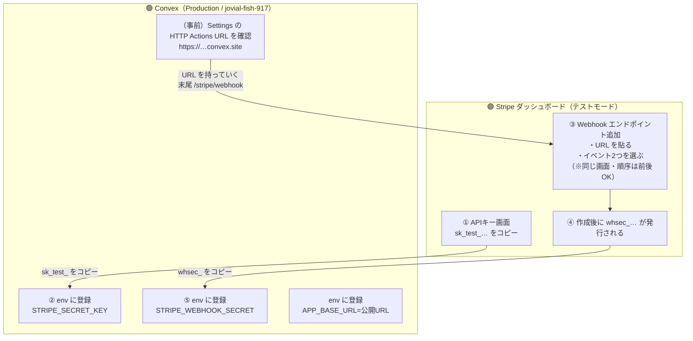
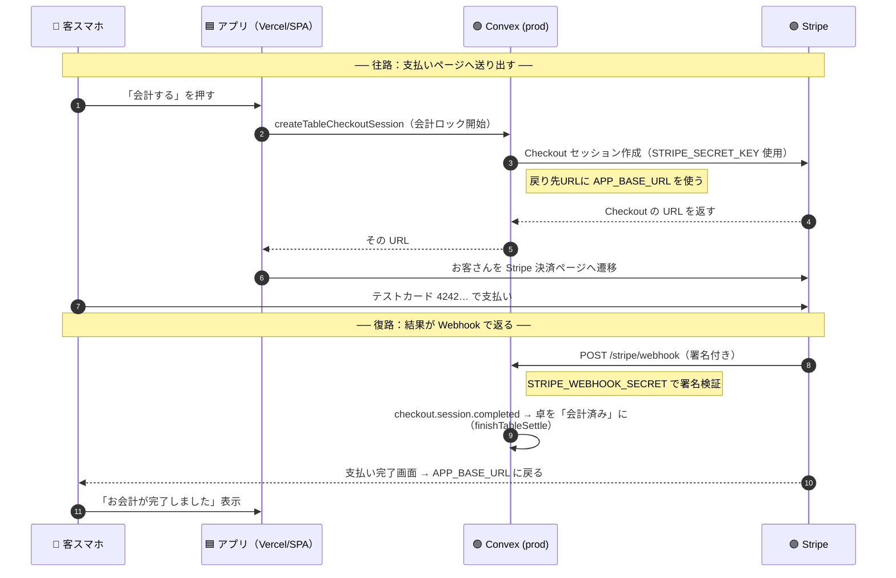

# Stripe ⇄ Convex の往復フロー

Stripe と Convex は2つの場面で「往復」します。混乱しやすいのでフローチャートにしました。

- **A. 設定（セットアップ）の往復** … キーと URL をどっちからどっちへ渡すか
- **B. 決済（実行時）の往復** … 実際に注文→支払いが流れるとき

> 📌 **どこに何を入れるかの結論**
> | 値 | 出どころ | 入れ先 |
> |---|---|---|
> | `STRIPE_SECRET_KEY`（`sk_test_…`） | Stripe | **Convex prod** env |
> | Webhook URL（`https://…convex.site/stripe/webhook`） | **Convex** | Stripe の Webhook 設定 |
> | `STRIPE_WEBHOOK_SECRET`（`whsec_…`） | Stripe（Webhook 作成後に発行） | **Convex prod** env |
> | `APP_BASE_URL`（`https://…vercel.app`） | 自分の公開URL | **Convex prod** env |

---

## A. 設定（セットアップ）の往復

「Stripe → Convex」と「Convex → Stripe」が**交互に1回ずつ**あるのがポイント。

### 往復の順番（言葉で）
1. **Stripe → Convex**：`sk_test_…` をコピーして Convex prod env `STRIPE_SECRET_KEY` に
2. **Convex → Stripe**：Convex の HTTP Actions URL（`…convex.site`）に `/stripe/webhook` を付けて、Stripe の Webhook URL 欄へ
3. **Stripe → Convex**：Webhook 作成で出た `whsec_…` を Convex prod env `STRIPE_WEBHOOK_SECRET` に
4. （別途）公開URLを `APP_BASE_URL` に

> ⚠️ **Stripe の Webhook 追加画面は UI 改定で「URL入力」と「イベント選択」の順序が前後します**。同じ画面内の操作なので、**どちらを先にしても結果は同じ**。選ぶイベントは必ず2つ：
> `checkout.session.completed` と `checkout.session.expired`。

> ⚠️ `STRIPE_WEBHOOK_SECRET` は**この URL 専用**。他プロジェクト（table-order 等）の値は流用不可＝必ず新規発行。

---

## B. 決済（実行時）の往復

お客さんが「会計する」を押してから卓が「会計済み」になるまで。**Stripe へ送り出す往路**と、**Webhook で結果が返る復路**の2本があります。

### 要点
- **往路**で使うのは `STRIPE_SECRET_KEY`（セッション作成）と `APP_BASE_URL`（戻り先）。
- **復路**で使うのは `STRIPE_WEBHOOK_SECRET`（Stripe からの通知が本物か署名検証）。
- Webhook が無い／秘密鍵が違うと、支払いはできても**卓が自動で「会計済み」にならない**（復路が届かない）。

---

## つまずきチェック
| 症状 | どの往復が切れているか |
|---|---|
| 「会計の開始に失敗」 | A② `STRIPE_SECRET_KEY` 未設定/dev側に入れた |
| Stripe 画面に飛ぶが戻りが変 | `APP_BASE_URL` 未設定/誤り |
| 支払えるが「会計済み」にならない | A③ `STRIPE_WEBHOOK_SECRET` 未設定、または Stripe 側 Webhook URL/イベント誤り（復路断） |

> Webhook の健全性は、署名なしで叩いて **400** が返れば「ルートが存在し検証も効いている」サイン：
> `curl -X POST -H "stripe-signature: x" --data '{}' https://jovial-fish-917.convex.site/stripe/webhook`
